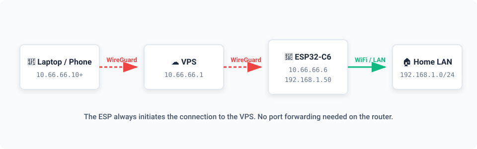

<div align="center">

# wgesp: The smallest ESP32 Wireguard server

[](https://juanre7.github.io/wgesp/)
[](https://github.com/juanre7/wgesp/issues?q=is%3Aissue+is%3Aopen+label%3A%22help+wanted%22)
[](https://opensource.org/licenses/MIT)


</div>

An ESP32-C6 plugged into mains power and your home WiFi opens an **outbound**
WireGuard tunnel to a VPS. From anywhere you connect to the VPS and reach your
home network; if you want, you can also browse the internet with your home public
IP address. **No port forwarding on the router, ever.**

<div align="center">
  
</div>

The ESP always initiates the connection and keeps it alive with a 25 s keepalive,
so the home router needs no configuration at all. That is the whole point: it
works behind CGNAT, behind a landlord's router, behind anything that will not let
you open a port.

## 🚀 Status

Working and in daily use for months.

| | |
|---|---|
| Throughput, download / upload | **5.4 / 4.6 Mbit/s** |
| CPU at that throughput | 20-30 % |
| Software crypto ceiling | 26 Mbit/s |

The limit is the radio and the ISP, not the ESP32. There is 3-5x of CPU to
spare. Plenty for the router admin page, home automation, SSH, banking or modest
video; not for large file transfers.

Those numbers come from one house, one ISP and a board sitting at RSSI -73 dBm.
Yours will differ. `/dump` (below) measures your own.

## 🛠️ What you need

- **An ESP32-C6 board with 2 MB of flash or more.** Developed on a DFRobot Beetle
  ESP32-C6 (DFR1117, [wiki](https://wiki.dfrobot.com/dfr1117)), ESP32-C6FH4 at
  160 MHz. Nothing in the firmware is specific to it except the LED pin.
- **ESP-IDF 5.5** on the build machine.
- **A VPS with a public IP and root access.** `vps/setup.sh` provisions one from
  scratch; if you already run WireGuard there, add the ESP as one more peer
  instead. The script refuses to overwrite an existing server, on purpose.

Start at `vps/README.md`: VPS, then DNS, then ESP32.

## 📖 Build and flash procedure

1. Set the target:

   ```bash
   idf.py set-target esp32c6
   ```

2. Make the build:

   ```bash
   idf.py build
   ```

3. Write the firmware to the board and monitor the console:

   ```bash
   idf.py -p /dev/ttyACM0 flash monitor
   ```

The console must show `NAPT active` and subsequently `peer UP`.

The script `scripts/build.sh` makes the same build. It also reads
`sdkconfig.local`.

### Configuration

Put your configuration in the file `sdkconfig.local`, in the root directory of
the repository. The file `.gitignore` contains its name. The file holds the WiFi
credentials and the WireGuard keys. The script `vps/setup.sh` prints the lines:

```
CONFIG_EXAMPLE_WIFI_SSID="..."
CONFIG_EXAMPLE_WIFI_PASSWORD="..."
CONFIG_WGESP_PRIVATE_KEY="..."
CONFIG_WGESP_PEER_PUBLIC_KEY="..."
CONFIG_WGESP_ENDPOINT="vpn.example.com"
CONFIG_WGESP_LAN_IP="192.168.1.0"
```

**WARNING: Do not put the keys in git.** Persons who read the repository can then
get access to your network.

**CAUTION: The build reads `sdkconfig.local` only when it makes the file
`sdkconfig`.** If you change `sdkconfig.local`, delete `sdkconfig` and make the
build again. If you do not delete `sdkconfig`, the board gets firmware without
your change.

The other parameters are in `menuconfig`, under **wgesp**. With no private key
the firmware boots into WiFi + SNTP only, which is a useful first check.

## 💡 The board and its LED

The firmware drives one LED, on pin IO15/D13 (`LED_GPIO` in `main/main.c`):

| Signal | Condition |
|---|---|
| 1 short flash | The firmware starts. |
| 2 short flashes | The tunnel becomes operational. |
| 1 flash of 1 second | A client starts to send data, or a client is silent for 60 seconds. |

`CLIENTS_IDLE_US` in `main/clients.h` sets the silent time. WireGuard has no
sessions and reports no connections, so this is as close to "client in/out" as
anyone can get from here.

The Beetle has a second LED, for the battery charger. The TP4057 drives it, not
the ESP32, and it blinks forever when no battery is connected. **No firmware can
turn it off.** Tape over it, connect a LiPo, or desolder its series resistor.

## 👥 Procedure to add a client

Do all the steps on the VPS. Do not change the ESP32.

If the client needs access only to the home network, no step is necessary. Its
profile must have `AllowedIPs = 0.0.0.0/0`. The client then receives the route
automatically.

If the client must also send its internet traffic through your home connection,
do these steps:

1. Copy the script to the VPS:

   ```bash
   scp vps/enable_home_exit.sh root@vpn.example.com:
   ```

2. Start the script for the new client:

   ```bash
   ssh root@vpn.example.com 'CLIENT=tablet CLIENT_IP=10.66.66.12 bash enable_home_exit.sh'
   ```

3. Start the MTU script on the VPS:

   ```bash
   ssh root@vpn.example.com 'bash fix_mtu.sh'
   ```

**CAUTION: Do not omit step 3.** The script sets the MTU for each route and
adjusts the TCP MSS in the two directions. If you do not start it, the tunnel
discards large packets and the throughput becomes very low.

The script of step 2 does not change the keys of the other clients and does not
stop the interface. You can start it again safely. It prints the profile of the
new client. To show that profile as a QR code, use this command:

```bash
ssh root@vpn.example.com 'qrencode -t ansiutf8 < /etc/wireguard/wgesp/tablet.conf'
```

Address allocation: `.1` VPS, `.6` ESP32, `.10` onwards for clients that exit
through home.

## 📊 Status page

From anywhere already inside the tunnel:

| Address | Function |
|---|---|
| `http://10.66.66.6/` | The status page |
| `http://10.66.66.6/txt` | The same data as plain text, for curl and scripts |
| `http://10.66.66.6/dump?mb=50` | 50 MB of test data, to measure your throughput |

It shows uptime, the boot count and the reason for the last reboot, peer state,
CPU, chip temperature, heap, NAPT table occupancy, and the clients seen with how
long they have been quiet.

Read-only on purpose: no forms, no writes. And it only answers those who arrive
through the tunnel: a request to the LAN address is refused when the connection
is opened. Going through WireGuard **is** the authentication.

`CONFIG_WGESP_MDNS` also publishes the page as `http://wgesp.local/` on the home
LAN. It is off by default, because it costs 38 KB of flash.

**WARNING: If you set `CONFIG_WGESP_MDNS` to on, every person on your WiFi
network can read the status page.**

## 🤖 How it looks after itself

The device lives alone, plugged in, with nobody watching it:

- It retries the WiFi connection forever (`CONFIG_EXAMPLE_WIFI_CONN_MAX_RETRY=-1`).
  With `0` it gives up at the first drop, which is not what the name suggests.
- It syncs the clock over SNTP before bringing the tunnel up, because WireGuard
  rejects handshakes with a skewed clock, and resyncs every hour.
- If the tunnel stays down for 5 minutes it reboots itself
  (`CONFIG_WGESP_RESTART_AFTER_MIN`). This is the safety net for the jams nobody
  can anticipate. A full boot takes about 20 s.
- An **RTC watchdog** reboots the chip even when the whole CPU is stuck. It runs
  in the always-on power domain, on its own clock, so it does not depend on
  FreeRTOS. Tested by deliberately freezing the task that feeds it.
- When the **NAPT table** fills up, lwIP evicts the oldest entry and sends a TCP
  reset instead of hanging. The firmware logs a warning when eviction starts, or
  when the table goes over 75 %.

## 🔒 Security, and its limits

Whoever reaches the status page has already been through WireGuard, and the page
writes nothing. The keys live in `sdkconfig.local`, outside git.

**WARNING: The flash memory is not encrypted.** A person with physical access to
the board can read the memory and get the private key and the pre-shared key.

That person can then run a device the VPS accepts as this ESP32. They cannot read
anybody else's traffic: WireGuard derives new session keys at every handshake and
authenticates each peer by public key. If a board is lost, delete its peer from
`wg0.conf` on the VPS and the stolen keys are worth nothing.

Flash encryption in Release mode closes that hole, but it also switches the ROM
into Secure Download Mode. From then on OTA is the only way to update the
firmware, and two OTA partitions do not fit comfortably in 2 MB. On a board with
4 MB or more, do these steps in this sequence:

1. Make OTA operational and test it.
2. Add the Secure Boot signature.
3. Set the log level to zero.
4. Disable the USB-JTAG interface with an eFuse.
5. Set flash encryption to Release mode.

**WARNING: The eFuses are permanent and you cannot remove them.** Step 5 prevents
all subsequent use of the USB interface to write the firmware.

## 📁 Repo layout

| Path | What it is |
|---|---|
| `main/` | The application: WiFi, SNTP, tunnel, NAPT and the safety reboot |
| `main/status.c` | The status page, the CPU meter and the `/dump` bench |
| `main/crypto_bench.c` | On-chip cipher bench (`CONFIG_WGESP_CRYPTO_BENCH`) |
| `components/wireguard/` | droscy/esp_wireguard, vendored (see `ORIGIN.md`) |
| `vps/` | Server provisioning, client enrolment, MTU and MSS fixes |
| `scripts/` | Build, flash and monitor without interaction, agent-friendly |

## 📜 License

MIT (`LICENSE`). `components/wireguard/` is vendored third-party code and keeps
its own BSD-3 license; the two local patches are documented in
`components/wireguard/ORIGIN.md`.

---

The procedures and the warnings in this document use ASD-STE100 Simplified
Technical English. The rest is ordinary prose.
